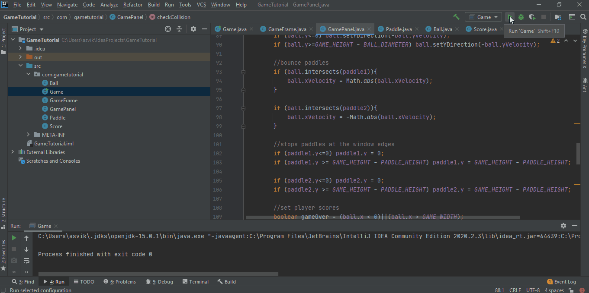

# PongGameTutorial

Just a simple implementation of the Pong game in Java 12 SE.

The main purpoise of the project is to privide evolutionary refactoryng of the internal model of the project from the simple code to well-known patterns and best practises.
The simple, well known, and well visualized code basis should help to understand better implemented approaches of refactoring being done during this project.

Enjoy!

